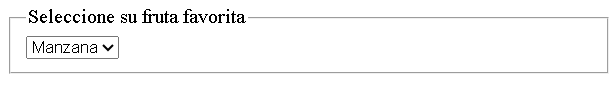

# HTML - legend y fieldset.

Las etiquetas `legend` y `fieldset` en **HTML** se utilizan para agrupar elementos relacionados en un formulario, proporcionando una estructura lógica y mejorando la accesibilidad. La etiqueta `fieldset` crea un grupo de controles, y la etiqueta `legend` proporciona una leyenda descriptiva para ese grupo.

## Etiqueta `fieldset`.

La etiqueta `fieldset` se usa parar agrupar elementos relacionados dentro de un formulario. Visualmente, añade un borde alrededor del contenido que contiene, lo que ayuda a los usuarios a identificar grupos de campos relacionados.

**Atributos de `fieldset`**

- `disabled`: Desactiva todos los cotroles dentro del `fieldset`.

- `form`: Asocia el `fieldset` a un formulario específico por su id.

## Etiqueta `legend`.

La etiqueta `legend` se utiliza dentro del `fieldset` para proporcionar una leyenda o título descriptivo para el grupo de campos. Esto ayuda a los usuarios a entender el propósito del conjunto de campos.

*Ejemplo:*

```HTML
<fieldset>
    <legend>Seleccione su fruta favorita</legend>
      <select id="frutas" name="frutas">
        <option value="manzana">Manzana </option>
        <option value="platano">Plátano </option>
        <option value="cereza">Cereza </option>
        <option value="naranja">Naranja </option>
        <option value="uva">Uva </option>
    </select>
</fieldset>
```
